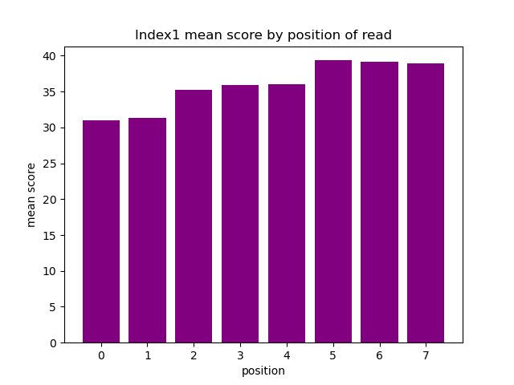
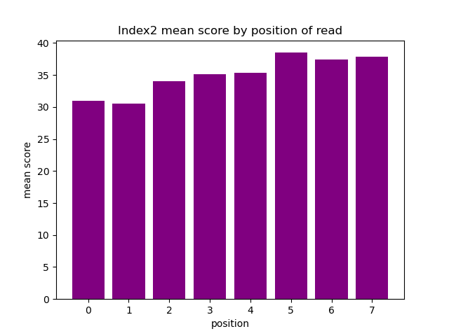
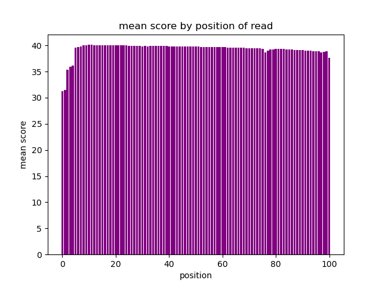
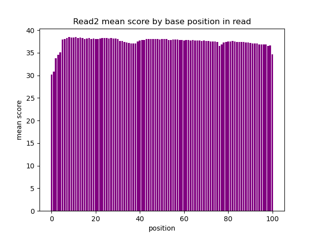

# Assignment the First

## Part 1
1. Be sure to upload your Python script.

| File name | label |
|---|---|
| 1294_S1_L008_R1_001.fastq.gz | read1 |
| 1294_S1_L008_R2_001.fastq.gz | index1 |
| 1294_S1_L008_R3_001.fastq.gz | index2 |
| 1294_S1_L008_R4_001.fastq.gz | read2 |

2. Per-base NT distribution
    1. 
    <p>
    
    
    
    
    </p>
    
    2. 
    ```
    A good cutoff for quality score of index reads and biological reads is 20. The difference in % error between a score of 10 and 20 is much larger than the difference in % error between 20 and 30 (GATK). In this case, we will accept the lower quality score of 20, indicating a 1% error, in order to retain a higher percentage of our reads, but we are not willing to accept a quality score of 10, indicating a 10% error.
    ```
    3. 
    ```
    Index 1 count of indexes with at least 1 undetermined base:
    zcat /projects/bgmp/shared/2017_sequencing/1294_S1_L008_R2_001.fastq.gz | sed -n '2~4p' |  grep N | wc -l
    3976613
    ```
    ```
    Index 2 count of indexes with at least 1 undetermined base:
    zcat /projects/bgmp/shared/2017_sequencing/1294_S1_L008_R3_001.fastq.gz | sed -n '2~4p' |  grep N | wc -l
    3328051
    ```


    
## Part 2
1. Define the problem
```
We want to bucket our multiplexed data. We also know that we have some index hopping present in the data, meaning we have to filter out the bad indexes. 
```
2. Describe output
```
The output should include two fastq files for each index-pair: one each for read1 and read2 (24 unique indexes * 2 read files= 48 output fastq files). We should then have two separate fastq files for non-matching index-pairs: one each for read1 and read2 (1 group mismatched * 2 read files = 2 output mismatched index fastq files). We should then output another two fastq files that hold the reads for unknown/low-quality index-pairs: one for each of read1 and read2 (1 group unknown/low-qual * 2 read files = 2 output unknown/low-quality fastq files). Total: 52 output fastq files.

The header for each of the reads in these files must include BOTH index1 and index 2 separated by a hyphen.

We also want to track the number of reads that fall into each of these categories. ALSO, for each of the mismatched index, we want to track the number for each possible combination, up to 24!, number of combinations.
```
3. Upload your [4 input FASTQ files](../TEST-input_FASTQ) and your [>=6 expected output FASTQ files](../TEST-output_FASTQ).
4. Pseudocode
```
Create dictionary for each output category (defines the file they end up in).

Open each of the files to read through each corresponding record simultaneously.

    For loop to read each record and compare indexes:
        
        Reverse complement index2 
        
        Calculate quality score for each of the current indexes

        If either index contains 'N':
            store record 1 to read1_lowqual category of dict
            store record 2 to read2_lowqual category of dict
        elif either index is below quality threshold:
            store record 1 to read1_lowqual category of dict
            store record 2 to read2_lowqual category of dict
        elif index1 != index2:
            store record 1 to read1_mismatch category of dict
            store record 2 to read2_mismatch category of dict
        elif match:
            store record 1 to read1 for specific index category of dict
            store record 2 to read2 for specific index category of dict

Output all files to specified output category (defines the file they end up in).

```
5. High level functions. For each function, be sure to include:
    ```
    reverse complement function
    1. Description/doc string
        will be used to reverse compliment index2
    2. Function headers (name and parameters)
        name: reverse_complement
        parameters: string to be reverse complemented
    3. Test examples for individual functions
        Input: CCCCCCCC
        Output: GGGGGGGG
    4. Return statement
        returns: reverse complement of input string
    ```
    ```
    contains n function
    1. Description/doc string
        will be used to check if N present in index
    2. Function headers (name and parameters)
        name: contains_n
        parameters: string to be checked
    3. Test examples for individual functions
        Input: NGCAGCAA
        Expected output: True
    4. Return statement
        returns: True or False
    ```
    ```
    quality score function
    * just pull from Bioinfo module 
    ```
    ```
    other potential functions:
        * output dictionary to files function
        * calculate length of each dictionary component

    ```

### Sources:
```
Phred-scaled quality Scores – GATK. GATK. (n.d.). https://gatk.broadinstitute.org/hc/en-us/articles/360035531872-Phred-scaled-quality-scores. 
```